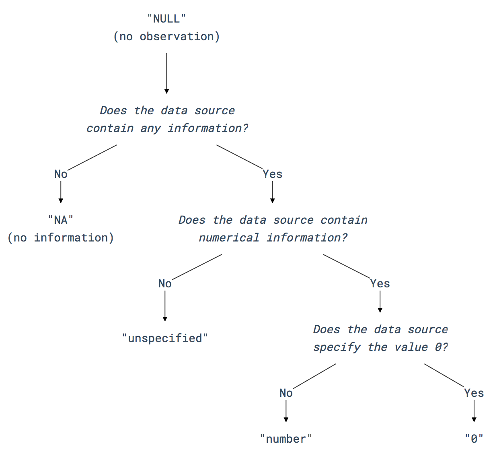

# Codebook for MI database

This file and [`codebook.csv`](codebook.csv) document the structure of the data file and documents its variables. Codebooks are a common way to document data files and their contents. 

## Codebook columns

The codebook has the following columns:

1. `variable_name`: The name of the variable
2. `notes`: Description of the variable, including notes, remarks, or comments that contextualise the conveyed information.
3. `unit`: The unit that applies to the variable. 'n/a' if it has no unit, e.g. for a comment variable.
4. `values`: An explanation of the allowable values for this variable, e.g. integer, float number, text, etc. This can have multiple items, but only the first will be considered by the verification algorithm. 
5. `classification_scheme`: Provides a scheme which the variable follows, e.g. an ISO standard.
6. `missing_data`: Describes how missing values are treated for the variable.
7. `required`: [TRUE, FALSE] Indicates if the variable is required for submission of new data. A 'True' value means that the field cannot be empty. If the data source does not provide data it must be 'NULL' or 'n/a'. See section [special values](#special-values) for more details.

The database contains *primary* and *secondary* attributes (see the `required` keyword in the list above). Primary attributes are mandatory throughout database and for any data new data contributions, while secondary ones are optional.

Please also consider the technical file formatting guidelines described in the [contributing document](CONTRIBUTING.md).

## Special values

This section explains the logic for resolving missing or ambiguous values. It is differentiated between *no observation* and *no information*. Therefore, missing values have different notation with `NULL` referring to the former and `NA` to the latter. The following figure illustrates the decision process. `NULL` is the default value for empty or missing values. Only if the data contributor is certain that the data source does not contain a value the value `NA` is used. In case the data source contains a reference to the parameter in question, but does not provide a numerical value the value `unspecified` is used. Otherwise the numerical value is used. The number `0`must only be used if it is specified or implied as such.

In summary:

- `empty value`: The database must not contain any empty values.
- `NULL`: Missing value that has *no observation*. This is the default empty value of cells in a new column or row. That means, the parameter was not evaluated by the person providing the data. For example, this is the default value if a new column is added to the database. Without revisiting the studies it is not possible to make a judgement on the values and all rows would therefore be NULL. The same applies if a data contributor decides not to provide the (optional) secondary data attributes – they need to be NULL. Ideally there should be no NULL valued cells in the database and contributors are encouraged to resolve NULL values.
- `NA`: Missing value that has *no information*. That means no data was provided, is not applicable, or could not be attributed. This implies that the data contributor looked for the data in the source, but no (suitable) value was found. An example: If a study on buildings reported only steel in reinforced concrete buildings, then the 'concrete' column will be 'NA', since no value for concrete is present. It is at the contributor's discretion to calculate the concrete from the available numbers and mention the calculation steps in the comment column. 
- `unspecified`: The data source contains an explicit unspecified value, such as "unspecified", "not available", "-", "unknown", "unclear", "trace amounts", "some", etc. This means that the data creators considered this attribute but have not provided a numerical value (zero or non-zero number). An example: In a study on a building the data creators state that copper content is known to be part of the building in an unknown amount shall have 'unspecified' in the corresponding column.
- `0`: A zero value is simply maintained as the number zero (0). However, it must only be used if the number has been measured and provided in the data source. It must not be used as a placeholder for missing values.

The release 1.0 version database contains a number of NULL values as the authors added these attributes at a later stage of the project.

## References

- https://www.ukdataservice.ac.uk/manage-data/document/data-level/tabular
- https://www.icpsr.umich.edu/icpsrweb/content/shared/ICPSR/faqs/what-is-a-codebook.html

