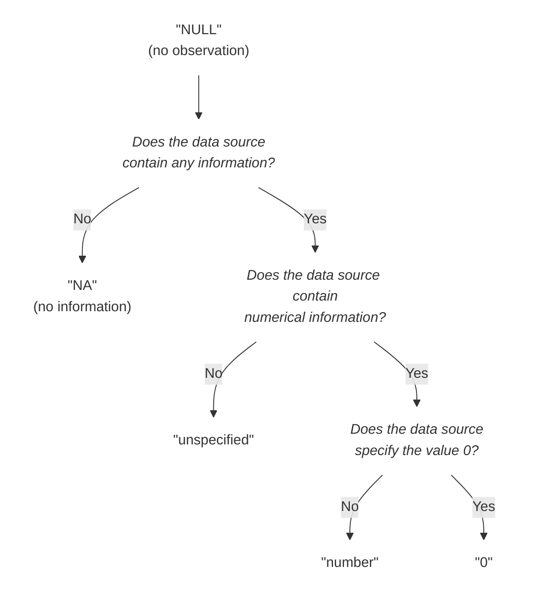

# Figures

Hopefully Github will enable [rendering of graphs](https://github.com/github/markup/issues/533) one day... The figure below is a screenshot from the rendering in [Typora](https://typora.io).

## special_values figure

This is the code for the  [mermaid graph](https://mermaidjs.github.io) in the [codebook.md](../../codebook.md) file. 

